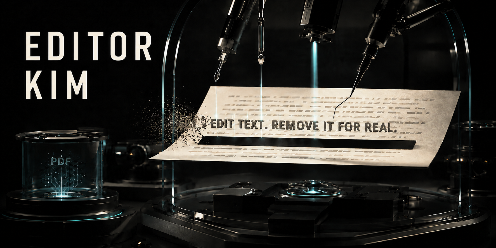
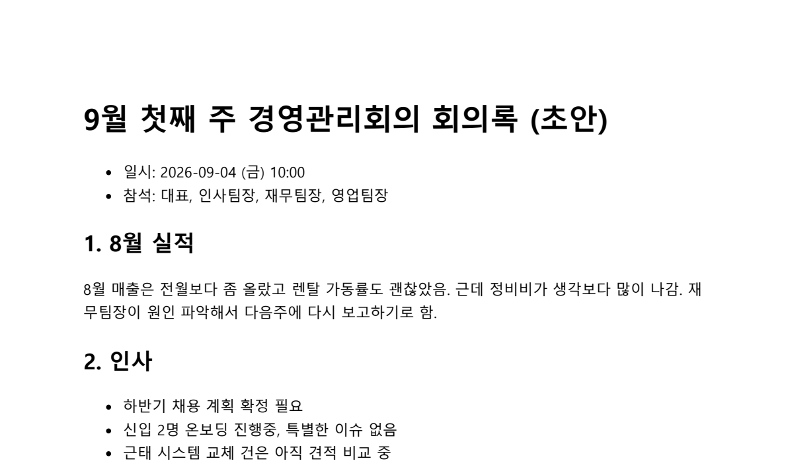
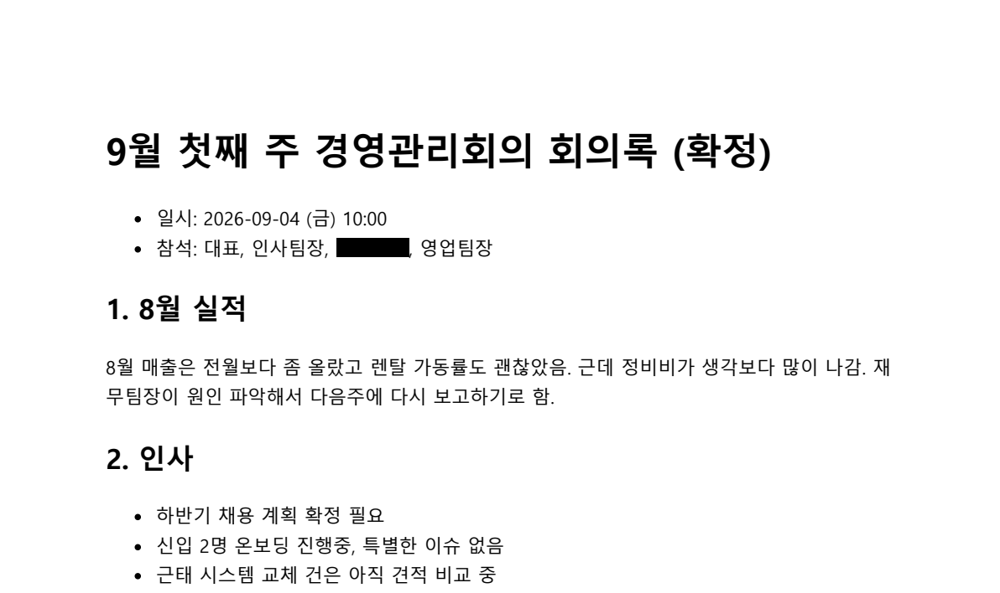
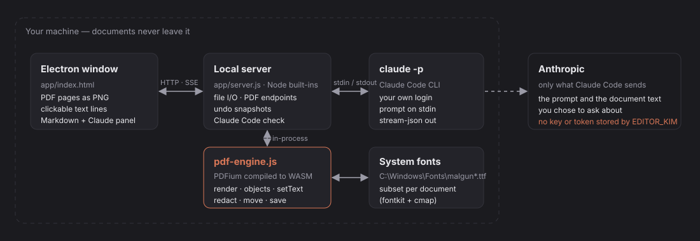
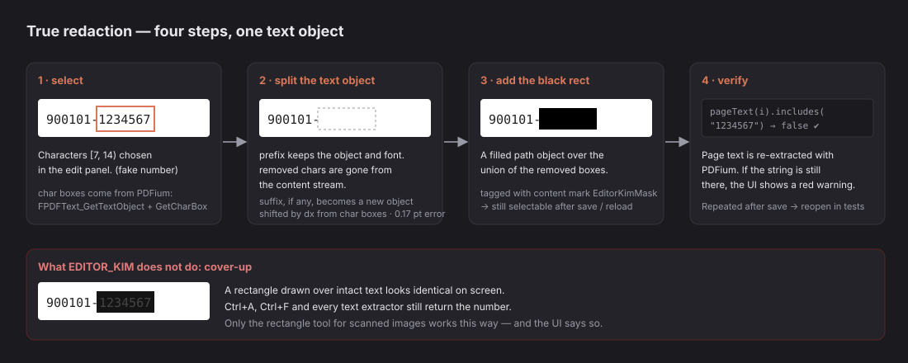

# EDITOR_KIM



> 내 Claude Code 로그인으로 Claude를 부르는 PDF·Markdown 편집기 — **su** ([kindsusu](https://github.com/kindsusu))

<p align="center">
  <a href="README.md">English</a> ·
  <a href="README.ko.md"><b>한국어</b></a>
</p>

<p align="center">
  <a href="https://github.com/kindsusu/EDITOR_KIM/actions/workflows/ci.yml"></a>
  
  
  
  
  
  <a href="LICENSE"></a>
  
</p>

**PDF 안의 글자를 원본 폰트 그대로 고치고, 가릴 때는 정말로 지우는 로컬 데스크톱 편집기.**

시중의 "PDF 편집기" 대부분은 페이지 위에 덧그립니다. 글자는 파일 안에 그대로 남아서, 주민번호 위에 검은 막대를 얹어도 Ctrl+F와 복사, 텍스트 추출기에는 그대로 나옵니다. EDITOR_KIM은 페이지 콘텐츠 스트림을 다시 씁니다. 텍스트 객체를 바꾸고, 임베드된 폰트를 유지하고, 가릴 글자 앞뒤로 객체를 쪼갠 뒤, **페이지 텍스트를 다시 추출해 정말 사라졌는지 확인**합니다. AI 패널은 API 키가 필요 없습니다. 이미 로그인된 Claude Code CLI를 자식 프로세스로 띄우므로 Pro나 Max 구독이면 됩니다.

## 목차

- [전 / 후](#전--후)
- [동작 구조](#동작-구조)
- [진짜 마스킹](#진짜-마스킹)
- [빠른 시작](#빠른-시작)
- [샘플 출력](#샘플-출력)
- [누구를 위한 것인가](#누구를-위한-것인가)
- [방법](#방법)
- [구성](#구성)
- [다른 도구와 비교](#다른-도구와-비교)
- [한계](#한계)
- [필요한 것](#필요한-것)
- [기여자](#기여자) · [라이선스](#라이선스)

---

## 전 / 후

Chromium이 내보낸 가상의 회의록입니다. 모든 줄이 글자 단위 텍스트 객체로 쪼개져 있고 폰트는 맑은 고딕 굵게 서브셋 — 가장 까다로운 경우입니다. 다른 뷰어의 스크린샷이 아니라 EDITOR_KIM의 엔진이 렌더한 그림입니다.

<table>
<tr><th>전</th><th>후</th></tr>
<tr>
<td></td>
<td></td>
</tr>
</table>

오른쪽에서 두 가지가 바뀌었습니다. 제목의 *(초안)*은 원본 폰트 객체에 `FPDFText_SetText`로 *(확정)*이 되었습니다. 폴백 폰트도, 재배치도 없습니다. 참석자 줄의 *재무팀장*은 마스킹되었습니다. 글자 객체 넷을 콘텐츠 스트림에서 제거하고 그 자리에 검은 사각형 하나를 넣었습니다. `npm run assets`로 재현할 수 있습니다.

---

## 동작 구조



프로세스 셋, 컴퓨터 하나. Electron 창은 Node 내장 모듈로 짠 로컬 HTTP/SSE 서버와 통신합니다. 서버가 PDF 엔진을 소유합니다. [`@embedpdf/pdfium`](https://www.npmjs.com/package/@embedpdf/pdfium)으로 WebAssembly 컴파일된 PDFium이 페이지를 PNG로 렌더하고, 텍스트 객체를 열거하고, 편집을 적용하고, PDFium 자체 writer로 저장합니다. pdf.js도 pdf-lib도 없습니다.

AI는 서버가 `claude -p --output-format stream-json`을 실행하고 프롬프트를 표준입력으로 넘겨 토큰을 스트리밍합니다. 키도 토큰도 저장하지 않습니다. 과금은 사용자와 Anthropic 사이의 문제이며, Pro/Max 구독이면 구독 안에서 처리됩니다. 패널에는 API 환산 비용을 표시해 "내지 않은 돈"을 볼 수 있게 했습니다.

---

## 진짜 마스킹



이 프로젝트가 존재하는 이유가 이 함수입니다. 텍스트 객체와 글자 범위를 받으면:

1. PDFium에서 글자별 상자를 읽습니다 (`FPDFText_GetTextObject`가 페이지의 모든 글자를 그 글자를 그린 객체로 되돌려 주므로 좌표 근사가 없습니다);
2. 객체의 텍스트를 앞부분으로 바꾸고, 뒷부분은 같은 폰트·크기·색·행렬로 새 객체를 만들어 글자 상자 사이 거리만큼 옮깁니다 (측정 오차 0.17pt);
3. 제거된 글자 상자들의 합집합 위에 검은 채움 경로를 넣고 PDFium 콘텐츠 마크 `DaepilMask`를 붙입니다. 저장 후 다시 열어도 선택·이동·삭제 가능한 객체로 남습니다;
4. 페이지 텍스트를 다시 추출해, 제거한 문자열이 아직 있으면 완료로 치지 않습니다.

스캔본은 다릅니다. 지울 텍스트가 없으니 사각형 도구는 픽셀을 덮기만 하고, UI가 그렇게 말해 줍니다.

---

## 빠른 시작

**Windows는 빌드 없이:** [Releases](https://github.com/kindsusu/EDITOR_KIM/releases)에서 `EDITOR_KIM-<버전>-portable.exe`(바로 실행) 또는 `EDITOR_KIM-<버전>-setup.exe`(설치형)를 내려받습니다. 코드 서명이 없어 첫 실행 때 SmartScreen "알 수 없는 게시자" 경고가 뜹니다. *추가 정보 → 실행*을 누르세요.

[Claude Code](https://code.claude.com/docs/en/setup)가 설치·로그인되어 있어야 합니다 (Pro·Max·Team. 무료 플랜은 Claude Code를 쓸 수 없습니다). 앱이 시작할 때 검사하고, 없으면 별도 PowerShell 창에서 설치(`irm https://claude.ai/install.ps1 | iex`)와 로그인(`claude auth login`)을 안내합니다.

```bash
git clone https://github.com/kindsusu/EDITOR_KIM.git
cd EDITOR_KIM
npm install
npm start
```

Windows에서는 클론 후 터미널 없이 **`run-editor-kim.bat`** 을 더블클릭하면 됩니다. Node 확인, 첫 실행 시 `npm install`, 앱 시작까지 알아서 합니다.

그다음 **📂 파일 열기** → PDF 선택 → 줄에 마우스를 올리고 클릭 → 입력 → Enter → Ctrl+S. 알아둘 키:

| 키 | 동작 |
|---|---|
| Enter / Esc | 줄 편집 적용 / 취소 |
| Ctrl+S / Ctrl+Shift+S | 저장 / 다른 이름으로 저장 |
| Ctrl+Z / Ctrl+Y | 실행 취소 / 다시 실행 (문서당 20단계) |
| ◀ ▲ ▼ ▶ (Shift) | 줄을 0.5pt(5pt) 이동 · 드래그도 가능 |
| 선택 글자 가리기 | 패널에서 선택한 글자를 마스킹 |
| ▭ 마스킹 삽입 | 스캔본용 사각형 덮기 |

Electron 없이 브라우저만: `npm run serve` 후 http://localhost:4747 (파일 대화상자 없음, `workspace/`만 표시). 서브셋 폰트가 임베드된 Markdown → PDF: `npm run md2pdf -- in.md out.pdf`.

---

## 샘플 출력

`workspace/`의 시험지로 돌린 엔진 자체 검사 `npm test`:

```console
$ npm test

pageSize { w: 595, h: 842 }
objects[0] {"idx":0,"type":"text","text":"GenOffice-lite prototype - sample PDF","font":"Helvetica","size":12, ...}
render bytes 36162
setText(한글) { ok: true, fallbackFont: true }
setText(라틴) { ok: true, fallbackFont: false }
[회의록_초안.pdf] font=AAAAAA+MalgunGothicBold "월 " → {"ok":true,"fallbackFont":true} (폴백 폰트)
[회의록_초안.pdf] 원본 글자 재입력 → {"ok":true,"fallbackFont":false}
charBoxes 37 {"ch":"G","x0":60.576,"y0":739.784,"x1":68.448,"y1":748.844}
redact {"ok":true,"rects":[{"x0":125.668,"y0":627.332,"x1":149.732,"y1":637.116}],"inserted":6}
suffix 위치 오차 -0.168 pt
사각형 영역 {"dark":147,"n":147,"frac":1}
[회의록] 마스킹 저장·재열기 OK 57751 bytes

OK — 모든 검사 통과
```

`frac: 1`은 마스킹 사각형 안의 모든 픽셀이 검게 렌더됐다는 뜻이고, 그 아래 줄은 뒷부분 글자가 여전히 글자로 그려지는지 확인합니다. 한글 시험지는 가상의 문서이며 `tools/md2pdf.js`로 만들었습니다.

---

## 누구를 위한 것인가

- **다른 사람의 문서를 다루는 사람** — 인사, 총무, 법무. 서명된 PDF의 날짜를 고치거나 주민번호를 가려야 하는데 파일을 웹 서비스에 올리고 싶지 않은 경우.
- **한국어 사용자.** Word와 한글 출력물은 서브셋 폰트를 임베드합니다. EDITOR_KIM은 그 폰트에서 없는 글자를 정확히 판별하고 맑은 고딕(원본이 굵으면 굵게)으로 대체하며, 대체 폰트도 서브셋해서 51KB 파일이 7.5MB가 아니라 8KB쯤 커집니다.
- **Claude 구독자.** API 청구 없이 문서 AI를 쓰고 싶은 사람.

팀용이 아니고(단일 사용자, 서버 없음), 스캔본 전용 보관에도 맞지 않으며(덮기만 됨), macOS·Linux는 아직 아닙니다(미검증, 폴백 폰트 경로가 Windows).

---

## 방법

작은 작업 묶음 단위로 만들었습니다. 묶음마다 계약과 통과해야 할 검사를 먼저 적고, 통과해야 합쳤습니다. [`PLAN.md`](PLAN.md)가 진행 기록입니다. 결정, 계약, 도중에 발견한 함정. 그중 설계를 바꾼 것들:

- **서브셋 CID 폰트는 "글리프 없음"이라고 말하지 않는다.** `FPDFFont_GetGlyphPath`가 없는 글자에 `.notdef` 경로를 돌려주고, 없는 글자끼리 같은 포인터를 공유합니다. EDITOR_KIM은 사설영역 코드포인트 두 개로 notdef 포인터를 알아내 비교합니다. `FPDFFont_GetGlyphWidth`는 기본 폭을 돌려줘서 쓸 수 없습니다.
- **fontkit의 TTF 서브셋에는 `cmap`이 없다.** pdfkit은 글리프 ID로 그려서 필요가 없었고, PDFium은 cmap으로 유니코드를 찾으므로 없으면 □로 그립니다. EDITOR_KIM은 format 4 cmap을 써서 sfnt 디렉터리에 끼워 넣습니다. `name`, `OS/2`, `post`는 필요 없습니다.
- **자동으로 줄을 묶으면 표의 옆 칸까지 묶인다.** 기준선·간격 휴리스틱을 시도했다가 뺐습니다. 지금은 텍스트 객체 하나가 상자 하나이고, 묶음은 사용자가 Shift 클릭으로 정해 PDF 콘텐츠 마크(`DaepilGroup`)로 저장합니다. 줄바꿈 편집으로 생긴 줄들만 자동으로 한 그룹이 됩니다.
- **`FPDFText_SetText(obj, "")`는 WASM 모듈을 죽인다.** 빈 문자열은 엔진 경계에서 공백 하나로 바꿔 모든 호출자를 안전하게 했습니다.

---

## 구성

```
app/
  main.js            Electron 셸: 창, 파일·저장 대화상자, 닫기 4지선다
  preload.js         window.daepil 브리지 (openFiles, openFolder, saveAs)
  server.js          로컬 HTTP/SSE: 파일, PDF 엔드포인트, 실행 취소 스냅샷, Claude Code 실행
  pdf-engine.js      PDFium 래퍼: open · render · objects · setText · charBoxes · move · addRect · redact · pageText · save
  pdf-engine.test.js 순수 Node assert, CI가 windows-latest에서 실행
  index.html         UI 전체, 프레임워크 없음
tools/
  md2pdf.js          Markdown → PDF (Chromium printToPDF, 서브셋 폰트 임베드)
  demo-assets.js     assets/edit-before.png · edit-after.png를 엔진으로 재생성
workspace/           가상 시험지: 회의록_초안.md / .pdf, sample.pdf
PLAN.md              작업 계획과 검수 기록
```

의존성: `@embedpdf/pdfium`(엔진), `fontkit`(폴백 서브셋), `electron`(개발). 나머지는 Node 내장 모듈입니다.

---

## 다른 도구와 비교

| | EDITOR_KIM | GenOffice | Adobe Acrobat | pdf.js 기반 편집기 | Stirling-PDF |
|---|---|---|---|---|---|
| 원본 폰트로 글자 편집 | 예 (PDFium) | 예 (같은 PDFium 방식) | 예 | 아니오 — 페이지 위 주석 | 아니오 |
| 마스킹이 텍스트를 제거 | 예, 재추출로 검증 | — | 예 | 아니오 (덮기) | 일부 (페이지 평탄화) |
| 문서가 가는 곳 | 로컬 | 로컬 | 로컬 / 클라우드 | 로컬 | 자체 서버 |
| AI | Claude Code 로그인, 키 없음 | BYOK 또는 Genspark 로그인 | Adobe AI (유료) | — | — |
| 범위 | PDF + Markdown | Word · Excel · PowerPoint · PDF · MD | PDF | PDF | PDF 유틸리티 |
| 플랫폼 | Windows (검증) | Win · macOS · Linux | Win · macOS | 모두 | Docker |
| 라이선스 | 개인 무료 · 상업은 승인 | Apache-2.0 | 상용 | 대부분 공개 | MIT |

GenOffice가 가장 가까운 친척입니다. EDITOR_KIM은 엔진 선택을 거기서 가져오고 오피스 스위트는 두고 왔습니다.

---

## 한계

- **아직 Windows만.** 폴백 폰트를 `C:\Windows\Fonts`에서 읽습니다. macOS·Linux는 폰트 경로와 시험이 필요합니다.
- **회전된 텍스트는 편집하지 않습니다.** `redact`가 추측하는 대신 `reason: 'rotated'`를 돌려줍니다.
- **스캔본은 덮기만 됩니다.** 밑 이미지의 픽셀 제거는 다음 과제입니다.
- **실행 취소 스냅샷은 문서 전체입니다.** 600KB PDF × 20 = 파일당 12MB. 사무 문서에는 충분하고, 200쪽 스캔본에는 아닙니다.
- **서버가 절대경로를 그대로 믿습니다.** 로컬 단일 사용자 앱이고 경로는 OS 파일 대화상자에서만 옵니다. 4747 포트를 외부에 열지 마세요.
- **배포는 회색 지대입니다.** 내 로그인으로 내 용도에 Claude Code를 돌리는 것이 이 도구의 목적입니다. EDITOR_KIM을 제3자에게 배포하는 것은 Anthropic 약관 문제이며, 라이선스가 그것을 반영합니다.

---

## 필요한 것

- Windows 10 이상 (Windows 11에서 검증)
- Node.js 22+ (24에서 검증), Electron 44 (`npm install`이 설치)
- Claude Code 설치·로그인 — Pro, Max, Team
- 맑은 고딕 (Windows 기본 포함) — 한글 폴백용

---

## 기여자

- **su / [kindsusu](https://github.com/kindsusu)** — 방향, 제품 결정, 실제 문서로 시험
- Claude Code로 만들었습니다.

## 라이선스

개인 용도 무료. 기업·상업 용도는 원칙적으로 불가하며 저작권자의 사전 서면 승인 시에만 허용 — [`LICENSE`](LICENSE). 포함된 구성요소는 각자의 라이선스를 따릅니다: PDFium (Apache-2.0), @embedpdf/pdfium (MIT), fontkit (MIT), Electron (MIT).
